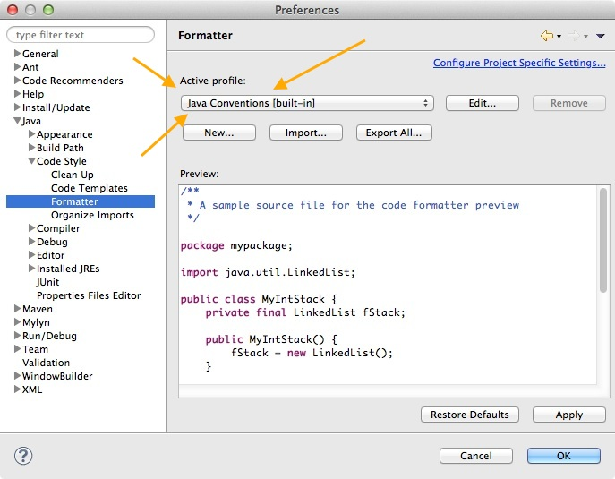
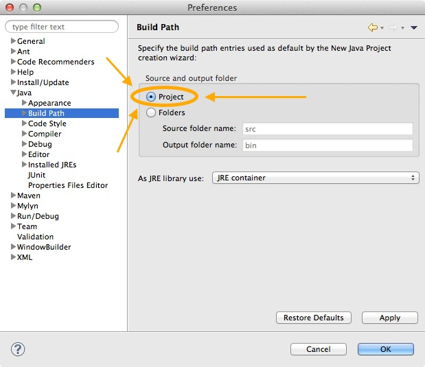

* [Lab 0 Home](index.html)
* [Warmup](warmup.html)
* [Part 1](part1.html)
* Part 2
* [Part 3](part3.html)
* [Submission](submission.html)

## Part 2 - Eclipse

    Now you should start <a href="http://www.eclipse.org/">Eclipse</a>.   This
    is a Java IDE (Integrated Development Environment) that is used world-wide.
    It has a number of very useful features including automatic compilation,
    error detection, built-in debugger, autocomplete, and many other features.

    Eclipse is available for free for your home machine, should you want some
    alone-time with it. Just go to the 
    <a href="http://www.eclipse.org/">Eclipse website</a> for download.

<h3>Start eclipse</h3>

    Just run it from the command line.  Open up a terminal window and type:

<pre class="boxed">
eclipse &amp;
</pre>

Alternatively, choose it from the graphical Development menu.

    <strong>You should just accept the default for workspace.  (Usually <tt>~/workspace/</tt>) <em>Please do not select your csci151 folder as your default workspace.</em></strong>  It'll take a bit to start up.

<h3>Do tutorial</h3>

    From the Eclipse Welcome page, click <b>Tutorials&nbsp;&gt;&nbsp;Create a
    Hello World Application</b>. Follow the instructions to make your very
    first eclipse Java program. Good times. 
    <!-- 
    When you're done with that, go back
    to the Welcome page, then click <b>Overview&nbsp;&gt;&nbsp;Workshop
    Basics</b>. Peruse some of these topics to familiarize yourself with some
    of eclipse's features.
    -->

<!-- 

    You should also read through this 
    <a href="http://www.comscigate.com/cs/valle/programming.htm">Eclipse Tutorial 3: Useful Programming Functions</a> (<a href="http://web.archive.org/web/20100930183113/http://www.javaprogrammingworld.com/eclipse-tutorial-part-3-useful-programming-functions/">cached</a>)
    and this
    <a href="http://www.javaprogrammingworld.com/eclipse-tutorial-part-5-running-and-debugging/">Eclipse Tutorial 5: Running and Debugging</a> (<a href="http://web.archive.org/web/20101006180206/http://www.javaprogrammingworld.com/eclipse-tutorial-part-5-running-and-debugging/">cache</a>). You'll be glad you did.

-->

<h3>Customize Eclipse preferences</h3>

    Until you get more familiar with eclipse and figure things out on your own,
    please make the following changes to your preferences to make life easier.
    Start by selecting the menu <b>Window &nbsp; &gt; &nbsp; Preferences</b> (On a Mac, it is located in <b>Eclipse &nbsp; &gt; &nbsp; Preferences</b>. 

<h4>Set preferences</h4>

First, let's deal with auto-completion and cursors.
   <!-- Start by selecting the menu <b>Window &nbsp;>&nbsp; Preferences</b>.  --> 
    Click on the triangles in
    front of <b>"Java"</b>, <b>"Editor"</b> and click on <b>"Typing"</b>.

    Notice that it will automatically insert closing braces, quotes, and the
    like by default.  I recommend that you keep these enabled.  It will take
    a little getting used to, but prevents annoying little bugs.

    The second section "automatically insert at correct
    position" has things that I really like to enable.  When you type either
    <tt>;</tt> or a brace, it'll jump to the right spot for it most of the
    time.  It's pretty nifty, try it out!

<h4>Fixing output to be more sane</h4>

    By default, Eclipse uses tabs for indentation.  However, it displays them
    as being only 4 spaces, when most other things will display them as 8.  A
    minor detail, but changing this will make things much more readable outside
    of Eclipse.  The easiest way is to change the preferences <b>"Java"</b>,
    <b>"Code Style"</b>, <b>"Formatter"</b> and then select <b>"Java
    conventions"</b> as the Active profile.
    <strong style="color: red;">If you change only one setting, make it this one!</strong>

    You can also get Eclipse to reformat your code when you are working on it in a number of ways.
    You can highlight a section of text and then hit "ctrl-I" or use the menu "Source", "Correct Indentation".  You can also use the "Source", "Format" command to make similar changes.
    You can also have it automatically reformat your code each time you save.  Go to <b>"Java"</b>, <b>"Editor"</b>, <b>"Save Actions"</b> and check the box marked "Perform the selected actions on save".  You can have just reformat the sections of code you have been working on, or you can have it take care of the entire file.

<h4>Javadoc</h4>

    If you take advantage of the auto-Javadoc comments, you'll probably want to
    also change the settings under <b>"Java"</b>, <b>"Code style"</b>, <b>"Code
    Templates"</b>, <b>"Comments"</b>, <b>"Overriding methods"</b> to match
    <b>"methods"</b>.  
    (Just copy and paste the <b>Pattern</b> window contents from "Methods" to
    "Overriding methods".)

<h4>Change the default build path</h4>

    In recent versions, Eclipse likes to put the *.class files in a different
    folder than your *.java files.  However, this makes things a bit harder to
    go between eclipse and a normal editor.  Change the preferences by selecting
    <b>"Java"</b> and <b>"Build Path"</b> and change the value of <b>'source and
        output folder'</b> radio button to be <b>"Project"</b> instead of <b>"Folder"</b>.
        Do not change the value of Source folder from <b>src</b> or Output
        folder from <b>bin</b> -- this is the radio button only.
    <strong style="color: red;">If you change only two settings, do this one too!</strong>

<h4>do some editing</h4>

    While you are working on stuff, you'll probably find that there are lots of
    functions you might want to use via the pull down menus.  Note that the
    keyboard shortcuts are listed on the right hand side.  Learning to use them
    will speed up your work.

    As a reference guide for some such shortcuts and nifty things, I'll refer you back to the 
    <a href="http://www.comscigate.com/cs/valle/programming.htm">eclipse tutorial</a>, and this list here:

* Note the smart insertion of things like '<tt>;</tt>'
* Quick fix using <tt>ctrl-1</tt> (thats a one)
* Rename all instances of a variable in one fell swoop using <b>Refactor &nbsp; > &nbsp; Rename</b>
* Add/remove comments (<tt>ctrl-/</tt>)
* Use <tt>ctrl-space</tt> to autocomplete names of classes and methods.  Try typing "sysout" and then <tt>ctrl-space</tt>
* Create a new class from interfaces or from a superclass using  the appropriate textboxes under <b>File &nbsp; > &nbsp; New &nbsp; > &nbsp; Class</b> 
* Debug in style with breakpoints, variable examination, watchpoints (see <a href="http://www.comscigate.com/cs/valle/running.htm">this tutorial</a> to learn more.)
* Set arguments for a command line <b>Run &nbsp;>&nbsp; Run configurations...</b>
* Generate getter and setter methods using <b>Source &nbsp;>&nbsp; Generate Getters and Setters</b>
* Generate constructors using <b>Source &nbsp;>&nbsp; Generate Constructor using Fields</b>
* Maximize the current area, or unmaximize using <tt>ctrl-m</tt>.
* Display line numbers by right-clicking on the left margin of the editor and selecting that setting

[&laquo; Previous](part1.html)   [Next &raquo;](part3.html)