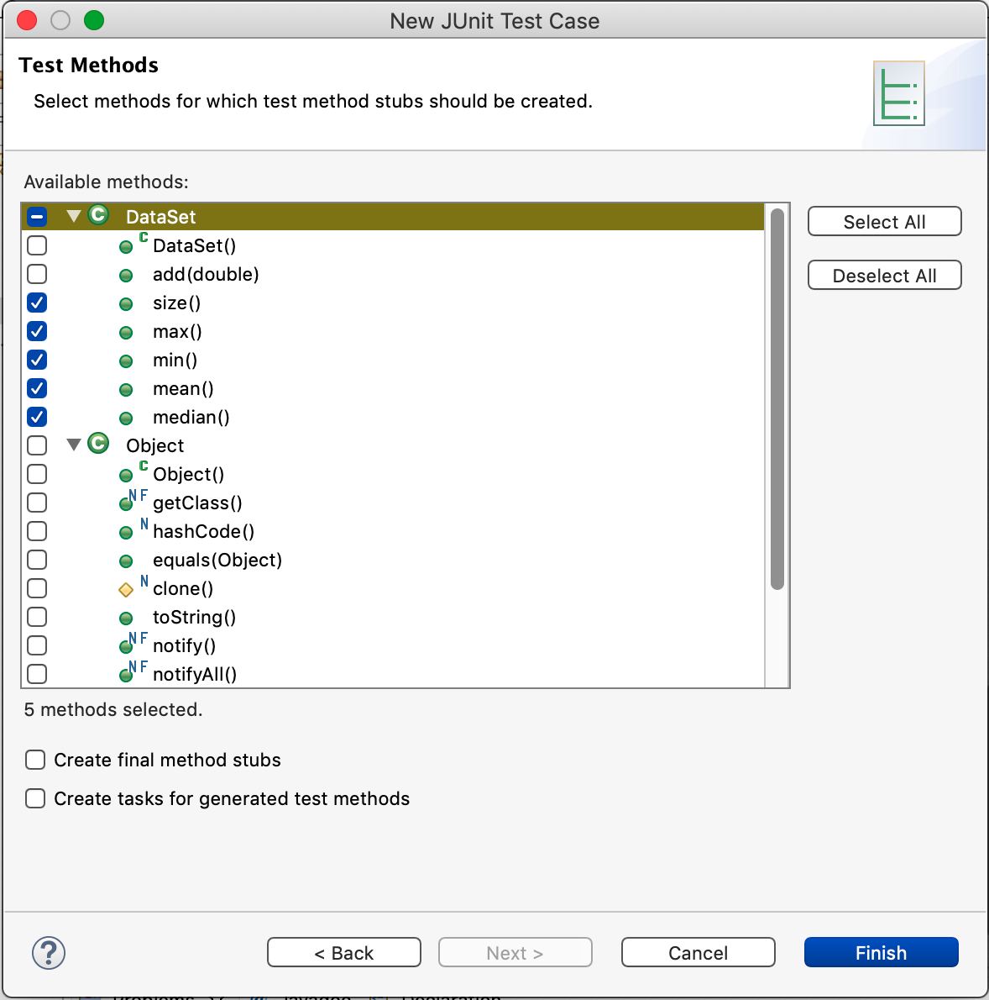

# Lab 3 Warmup

* [Lab 3 Home](index.html)
* Warmup
* [Part 1](part1.html)
* [Part 2](part2.html)
* [Part 3](part3.html)
* [Submission](submission.html)


## Part 1 -- Testing

Create a new Java project called `Warmup 3`. Create a new class called
`DataSet` with package `warmup3`. Copy all of the code from
[here](DataSet.java) into `DataSet.java`.

`DataSet` is a simple class that contains an `ArrayList` of `Double`s and can
compute some very simple statistics on them. Let's write some tests to make
sure that our new class behaves the way we want. In particular, we are going
to want to write tests for each of our nontrivial methods.

Create a new JUnit test case via `File > New > JUnit Test Case`. As long as
you do this while `DataSet.java` is open, Eclipse should fill in all the
correct values:
- New JUnit Jupiter test
- Package: `warmup3`
- Name: `DataSetTest`
- Class under test: `warmup3.DataSet`

Click `Next` (not `Finish`) and Eclipse will ask what methods you want to
create test method stubs for. Select all of the method so `DataSet` except for
the constructor `DataSet()` and `add(double)`.



Eclipse may tell you that "JUnit 5 is not on the build path." Click `OK` to
add the JUnit 5 library to the build path.


This will create a new class named `DataSetTest`. It's traditional that when
writing unit tests for a class `Thing`, the test class is named `ThingTest`.

There are two import lines in `DataSetTest.java` (Eclipse may have collapsed
them into a single line; if so click the small `+` icon to the left of the
import line to expand it). The first imports the assertion methods we can use
to write tests. The second imports the `@Test` annotation which we'll use to
indicate that the method should be run as a test. If you get errors on the
import lines after Eclipse created the class, you probably have a
`module-info.java` file. Delete it and everything should work.

Before we do anything else, let's run our test by selecting "Run" from the
"Run" menu. This will open up a "JUnit" tab and, if all has gone according to
plan, show
```
Runs: 6/6 Errors: 0 Failures: 6
```
Each of the generated `fail()` calls caused that test to fail.

Let's start by testing the `size()` method. Inside your `testSize()`, delete
the `fail(…);` and create a new `DataSet ds = new DataSet();`. Start by
testing that it starts out with no elements. Enter
```java
assertEquals(0, ds.size());
```
on the next line. `assertEquals(expected, actual)` will test that `actual` is
equal to `expected` and if it is not, then the test will fail. There are many
similar assertion methods. Most of them take an optional `String` to display
if the assertion fails. Here is a partial list of the supported methods where
the `[, message]` indicates the optional `String` argument.
- `assertEquals(expected, actual [, message])` — asserts that `actual` is equal to `expected`
- `assertNotEquals(unexpected, actual [, message])` — asserts that `actual` is not equal to `unexpected`
- `assertTrue(condition [, message])` — asserts that `condition` is `true`
- `assertFalse(condition [, message])` — asserts that `condition` is `false`
- `assertNull(actual [, message])` — asserts that `actual` is `null`
- `assertNotNull(actual [, message])` — asserts that `actual` is not `null`
- `assertThrows(expectedType, executable [, message])` — asserts that `executable` throws an exception of class `expectedType`; see below for details
- `fail(message)` — fails the test with the given message

Check out the [JavaDoc for a list of all of
them](https://junit.org/junit5/docs/5.0.1/api/org/junit/jupiter/api/Assertions.html).

Run the tests again. You should see 
```
Runs: 6/6 Errors: 0 Failures: 5
```

Go ahead and add a few more elements to the data set and test the size by
adding appropriate `assertEquals()` statements.

So far, everything is looking good; however, it's a good idea to make sure
that your tests are actually being run. The way to do that is to change your
test to be deliberately wrong. When you run the tests, it had better fail! Go
ahead and do so now. When you run the tests you should see the method in the
list of failures. On the bottom left quadrant of the Eclipse window, you
should see `Failure Trace`. If you double click on the line that says
`org.opentest4j.AssertionFailedError`, it'll show you what the actual and
expected values were.

Okay, fix your test and now write a test for `max()`. Make sure you add some
positive and negative numbers to your `DataSet`. Run your tests. You should
have fewer failures than before.

Create a test for `min()`. You can duplicate your test for `max()`, give it an
appropriate name, and modify any assertion statements appropriately.

If all the tests you have written up to this point pass, then I have some bad
news: your testing was insufficient. Go back to your tests for `max` and
`min`. Create multiple `DataSet`s and assert the values of `max()` and
`min()`. Try creating one that only has positive numbers; one that only has
negative numbers; one that only has the same number. Try to think of any other
[edge cases](https://en.wikipedia.org/wiki/Edge_case) and test those.

Which values inserted into your `DataSet` caused the method to fail?

# Part 2 -- Debugging

It's now time to debug what went wrong. For that, we can use the debugger.
Find the line of the assertion that failed. Double click on the line number.
This will cause a small blue dot to appear. This indicates a "break point."
When you run the code in a debugger, each time a break point is reached, the
debugger will stop and give you control. From the Run menu, select Debug.
(Select "Switch" if Eclipse asks if you want to switch to the debugging view.)
This will cause the tests to run until the line with the break point is
reached.

In the new debugging view, there are several important things to notice. The
left pane shows a "stack trace." This is a list of all of the methods that
were called to reach the current location. You'll notice there are a _lot_ of
them. Most of them are irrelevant; they're part of the JUnit testing
infrastructure. The top line should be `DataSetTest.testXXX()` corresponding
to the method the breakpoint is in.

The right pane has three tabs. The "Variables" tab shows the values of the
variables that are in scope. This is invaluable for figuring out what's going
on. No more adding print statements to see what the values of variables are,
the debugger will show you!

At the top of the window are a few nondescript buttons. . From left to right, they
are Resume, Suspend, Terminate, Disconnect (we won't need this), Step Into,
Step Over, and Step Return. Right now, Eclipse is in single-stepping mode
meaning we can step through statements one at a time. Step Over will execute
the statement and move to the next. Step Into does the same unless the
statement includes a method call in which case it will step _into_ the method
so that we can single step inside of it.

Click the Step Into button (or press F5) to step into the method that failed
the assertion. Step through the method using Step Over (or F6). After each
step, examine the contents of the Variables tab on the right to make sure that
the variables have the values you expect.

Once you have figured out the bug, you can stop debugging by clicking
Terminate. Fix the bug and rerun your tests. Hopefully, it's passing now. If
not, start the debugger again and give it another go. Debugging is an
iterative process. It's not uncommon to need to spend more time debugging code
than writing code.

# Part 3 -- Remaining tests

Implement tests for `mean()` and `median()`, fixing any bugs in the code your
tests uncover. Recall that the mean of n numbers x1 through xn is (x1 + x2 +
... + xn)/n. In contrast, the median of n numbers is the middle value if n is
odd and the mean of the two middle values if n is even. E.g., the median of 5,
3, and 100 is 5. The median of 5, 3, 100, and 6 is 5.5.

At this point, all of your tests should pass.

# Part 4 -- Exceptions

Finally, we need to handle some exceptional cases. What happens if we call
`max()`, `min()`, `mean()`, or `median()` if the `DataSet` is empty?

Let's change that behavior to throw an `IllegalStateException` if the
`DataSet` is empty. Add the following code to the beginning of each of those
four methods.

```java
if (data.isEmpty()) {
    throw new IllegalStateException("DataSet is empty");
}
```

Now we just need to add some assertions to our code that when we call those
methods with an empty `DataSet`, we get an the exception. To test that an
expression throws a particular exception, we need to use `assertThrows` with
some new syntax. Here's the test for `max()`.
```java
assertThrows(IllegalStateException.class, () -> ds.max());
```

The first argument, `IllegalStateException.class`, says that the expression
under test should throw an `IllegalStateException`. The second argument, `()
-> ds.max()`, is Java's syntax for an anonymous method that takes no arguments
and simply computes `ds.max()`.

Add similar assertions to each of the four methods that should throw. Make
sure you change `ds.max()` to call the appropriate method for each test.

[&laquo; Previous](index.html)   [Next &raquo;](part1.html)