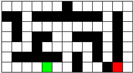

# Lab 4 -- Stacks and Queues: Simply A-Maze-ing!
## Part 0 -- Representing the Maze

First let's talk about your basic maze. It has walls and pathways as well as a
starting point and an ending point.  Furthermore, one wall is just like
another, and any open space (not including start and finish) is also
identical. So, we can think of a maze as being made up of individual squares,
each square either empty, a wall, the start, or the exit. Below is a graphical
representation of the maze found in the file maze-2. The green box represents
the start, the red box the exit, and the black squares the walls.




We represent such a maze with a text file of the following format. The first
line of the file contains two integers. The first indicates the number of rows
(R), the second, the number of columns (C). The rest of the file will be R
rows of C integers. The value of the integers will be as follows:
- 0 -- an empty space
- 1 -- a wall
- 2 -- the start 
- 3 -- the exit 

In terms of coordinates, consider the upper left corner to be position (0, 0)
and the lower right to be (R-1, C-1). For example, this is the text version of
the maze above (start is at (6, 4) and exit at (6, 11)).
```
7 13
0 0 0 0 0 0 1 0 0 0 0 0 0
1 1 0 1 1 1 1 1 1 1 0 1 0
0 1 0 0 0 0 0 0 0 0 0 1 0
0 1 0 1 1 0 0 1 1 1 0 1 0
0 0 0 1 0 0 0 0 0 1 0 1 0
0 1 1 1 1 1 0 1 0 1 0 1 0
0 0 0 0 2 0 0 1 0 0 1 3 0
```

### The Square Class
We have given you code for a class `Square` that represents a single square in
the maze. Squares hold their coordinates and an `int` representing their type
type (empty - 0, wall - 1, start - 2 or exit - 3).  Below are descriptions of
the `Square` methods you will need to use---for other methods, see the code.  

`public Square(int type, int row, int col)`
: constructor to create a new Square object

`public int getRow()`
`public int getColumn()`
`public int getType()`
: Accessor methods to get the values of the various instance variables. 

`public boolean isOnPath()`
`public void setOnPath()`
`public boolean isMarked()`
`public void mark()`
`public void reset()`
: These are accessor methods for attributes you will use to keep track of what
  you have done with the square while solving the maze.  The `setOnPath()` and `mark()`
  methods set their respective values to `true`; the `reset()` method sets all of the
  values to `false`.

`public void setPrevious(Square s)`
`public Square getPrevious()`
: Sets and gets the previous square you accessed.  You will use this to build the path in `MazeSolver`.
{: .implement-box}

### The Maze Class
We have also provided you with a `Maze` class that stores the logical layout
of a maze. You will be interested in the following methods; for more, see the
code:

`ArrayList<Square> getNeighbors(Square sq)`
: Returns an ArrayList of the Square neighbors of the parameter Square sq. 

`Square getStart()`
: Returns the starting square of the maze.
{: .implement-box}
