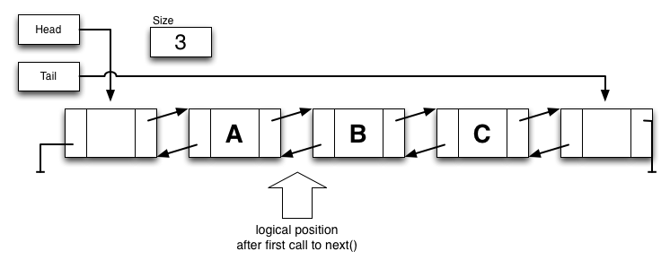

# Lab 5 -- Link 'em up!

* [Lab 5 Home](index.html)
* [Warmup](warmup.html)
* [Part 1](part1.html)
* Part 2
* [Part 3](part3.html)
* [Submission](submission.html)


## Part 2 -- ListIterator

Once your `MyLinkedList` class is working, you will need to create a
`ListIterator` which is returned by the `listIterator()` method. You can
do this through the use of a helper class `MyLinkedListIterator` nested in the
same file as `MyLinkedList`, in the same way as it was implemented in the
warmup. 
```java
class MyLinkedListIterator implements ListIterator<T> {

    // Instance variables here

    public boolean hasNext() {
            // Your code here
    }

    // More methods, etc.
}
```

The `ListIterator` is able to traverse the list by moving a space at a time in
either direction. It might be helpful to consider that the iterator has size+1
positions in the list: just before the head, between the 0 and 1 index, ...,
just after the tail. After one call to `next()`, the iterator is logically in
the state shown below.



You will need to implement all of the following methods. See
[ListIterator](https://docs.oracle.com/en/java/javase/11/docs/api/java.base/java/util/ListIterator.html)
for details.

### Public methods for `MyListIterator`

`public boolean hasNext()`
: Returns tru`e if there are more elements when going in the forward direction.

`public T next()`
: Returns the next element in the list when going forward.

  Throw a `NoSuchElementException` if there is no such element.

`public boolean hasPrevious()`
: Returns `true` if there are more elements when going in the reverse direction.

`public T previous()`
: Returns the next element in the list when going backwards.

  Throw a `NoSuchElementException` if there is no such element.
{: .implement-box}

### Programming Hints

Since the cursor of the `ListIterator` exists logically between two nodes, I
found it was useful to just keep references to the next `Node` and the previous
`Node`. I also kept an `int` value of the index of the next node.

If you construct your `MyLinkedList` to use sentinel nodes as discussed in the
book and lecture, and you properly throw exceptions for going out of range,
you shouldn't have to worry about checking for `null` values at the ends of
the list since the sentinel nodes are there.

You will need to keep some state information for the `Iterator` as well to
check if the underlying list has been modified since the iterator was created.
Modifications can leave the iterator in an undefined state. This happens, for
example, when the nodes around the current index are deleted. Therefore you
should check that the list hasn't been modified by before you let an iterator
move to another element.

An easy way to do this is to have both the list and the iterator keep track of
the number of modifications that have been made to the list. When the iterator
is created it grabs the list's modification count. If the iterator finds that
its modification count is different from the list's, you will know that the
list structure has been changed and that the iterator is no longer viable. See
[modCount](https://docs.oracle.com/en/java/javase/11/docs/api/java.base/java/util/AbstractList.html#modCount)
and the text for additional details and suggestions.  Throw a
`ConcurrentModificationException` in these cases.

### Public Methods to add to `MyLinkedList`

Once you are sure your iterator is working, you should override the following
methods in `MyLinkedList`. Each of these should just create a new
`MyListIterator` and return it.

`public ListIterator<T> listIterator()`

`public Iterator<T> iterator()`
: These methods return a new instance of `MyListIterator` for the current list.
{: .implement-box}

Note: You inherit a working `ListIterator` from `AbstractList`, but the one
you create will be more efficient. I suggest that while you are building and
initially testing `MyListIterator`, you create differently named methods to
use. I tend to use names like `QQQiterator()` and `QQQlistIterator()` until
I'm sure it is working correctly. If you jump right into overriding
`iterator()`/`listIterator()` then things like `toString()` may stop working
for you.

**Be sure to name them `iterator()` and `listIterator()` in your submitted
`MyLinkedList` and JUnit code. Some students in the past left it as
`QQQiterator()` which broke things, and made the graders think you had skipped
that step.**

### Testing your Iterator

You'll want to test `MyListIterator` and be sure that it works properly. You
should do this by printing out the entire list forwards and backwards using
your the iterator. Start at the beginning of the list and call `hasNext()` and
`next()` using a loop until `hasNext()` returns `false`, printing out the entry at
each step. This is similar to how you computed the `sum` in the warmup. Then,
use `hasPrevious()` and `previous()` to return each entry until the iterator
reaches the beginning of the list.

Test that if the underlying list is modified, your iterator throws a
`ConcurrentModificationException`.

[&laquo; Previous](part1.html)   [Next &raquo;](part3.html)