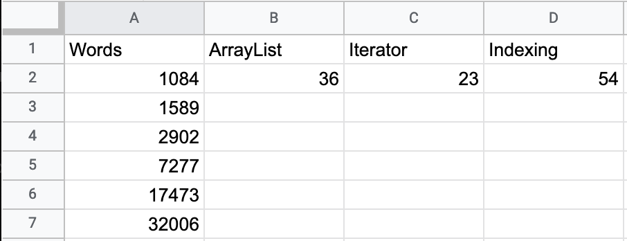

# Lab 5 -- Link 'em up!


* [Lab 5 Home](index.html)
* [Warmup](warmup.html)
* [Part 1](part1.html)
* [Part 2](part2.html)
* Part 3
* [Submission](submission.html)

## Part 3 -- Access speeds!

We saw in the warmup that sequentially accessing elements in a linked list by
index was slower than using an iterator. In this part of the lab, we're going
to experiment to see how the time it takes to access elements via index
changes with the length of the list.

The starter code for this lab includes an application program
`IterationTester.java`. This program opens up the text file whose name is given
in `args[0]` and makes a list of all of the different words that appear in the
file. Each time it reads a word it checks whether its wordlist contains this
word; if not, it adds it to the list. The program performs this algorithm
three times, and prints the number of milliseconds each attempt takes.

The first version maintains the list of words as an `ArrayList<String>`. To see
if a word is an element of the list, it uses `w = list.get(i)`.

The second version maintains the list of words as a `MyLinkedList<String>` and
uses an iterator to walk through the words of the list. At each step
`w = it.next()`. 

The third version again maintains the list of words as a
`MyLinkedList<String>`, but as with the `ArrayList` version it uses `w =
list.get(i)` to look for the word in the list. We saw in the warmup that this
is not very efficient. This exercise should help you to see just how
inefficient this is.

Use the program `IterationTester` to complete the following table. Put a
`README` file in your project folder that contains the three times for each
of these files. To save you a little time, I have included a start on this
`README` file in the starter code:
```
File                      Words    Unique Words    ArrayList Time    Iterator Time    Indexing Time
Prufrock.txt              1084             501             45 ms            28 ms            25 ms
IHaveADream.txt           1589             630
EveOfStAgnes.txt          2902            1566
KentuckyDerby.txt         7277            2605
MagnaCarta.txt           17473            2818
Hamlet.txt               32006            7718
```
Note that you might need to let the program run for several minutes on the
longer files.

Once you have run the program on all the text files and filled out the table,
go to [Google Sheets](https://sheets.google.com) and create a new spreadsheet
(you can log in with your Oberlin email and password, if you need to). Enter
the numbers in spreadsheet like this.



Select the entire table, including the header in row 1, and then from the
`Insert` menu, select `Chart`. Under `Chart type`, select `Line chart`. This
should create a chart with three lines, one for `ArrayList`, one for
`Iterator`, and one for `Indexing`.

As the number of words increases, the time it takes increases. The times taken
for three approaches do not grow at the same rate. Answer the following
questions by writing your responses in the `README`.
1. How do the growth rates for `ArrayList` and `Iterator` compare?
2. How do the growth rates for `Iterator` and `Indexing` compare?
3. If you were tasked with storing data in a list and you needed to
   sequentially examine elements in the list, which approach would you take
   and why?

By the way, here are those files:
- `Prufrock.txt` is "The Love Song of J. Alfred Prufrock" a poem by T.S. Eliot
- `IHaveADream.txt` is the famous speech given by Dr. Martin Luther King on August 28, 1963
- `EveOfStAgnes.txt` is the poem "The Eve of St. Agnes" by John Keats
- `KentuckyDerby.txt` is the short story "The Kentucky Derby is Decadant and Depraved" by Hunter S. Thompson
- `MagnaCarta.txt` is several versions of the Magna Carta
- `Hamlet.txt` is the play "Hamlet" by William Shakespeare
  
The files are in a folder `texts` in the project folder. Your arguments for
the Run Configurations file should be similar to `texts/Prufrock.txt`.

[&laquo; Previous](part2.html)   [Next &raquo;](submission.html)