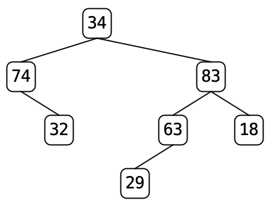

# Lab 6 -- Binary Trees

* [Lab 6 Home](index.html)
* [Warmup](warmup.html)
* [Part 1](part1.html)
* Part 2
* [Part 3](part3.html)
* [Submission](submission.html)

## Part 2 -- Loading a binary tree from a file

Your task for this part is to implement the `loadTreeFromFile()` method in the
`TreeLoader` class. We'll walk you through it.

The tree files for this lab list the nodes of the tree in postorder sequence,
one node per line. Each line contains a string, which is the data value stored
in the node, and two tag bits. The first tag bit indicates whether or not this
node has a left child or not (1 = yes, 0 = no). The second tag bit indicates
whether the node has a right child or not.

Let's look at an example.

The tree above is represented as
   32 0 0
   74 0 1
   29 0 0
   63 1 0
   18 0 0
   83 1 1
   34 1 1

The information in the file is sufficient to uniquely determine a binary tree.
The tree can be constructed from the file using the following algorithm.
1. Create an empty stack of binary trees (i.e. Stack<BinaryTree<String>>)
2. while there is another line of input in the file
   1. read a line (containing `data` and two tags)
   2. if right tag is 1, pop an element from the stack and call it `right`
   3. if left tag is 1, pop an element from the stack and call it `left`
   4. create a new binary tree with `data` as its root and `left` and `right`
      as its subtrees, if they exist, or new `EmptyTree` objects if they don’t
   5. push the new tree onto your stack
   {: style="list-style-type: lower-alpha;"}

When you exit the while loop, the stack should contain one element.
This element is the tree represented by the file data (so return it!).
If the stack is empty, the tree has no nodes, so the tree must be an `EmptyTree`.

**Note:** The input file is left then right, but the algorithm uses the right
value first, then the left. This is not a typo.

You need to implement this algorithm in the `loadTreeFromFile()` method.
The method should create a `Scanner` object to read strings from the file whose name is given as an argument. It should create a `Stack` of `BinaryTree<String>` objects to use as a work area. You can use Java's standard `Scanner` and `Stack` classes.

**Note:** Use Java generics in your code when declaring and instantiating a tree or stack. (For example, use `BinaryTree<String> `and `Stack<BinaryTree<String>>`.)

Test out your program, using `TreeApp` and clicking `Load File`. If you load `trees/tree7.txt`, you should see the tree shown above.

[&laquo; Previous](part1.html)   [Next &raquo;](part3.html)