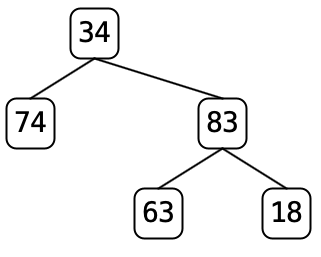
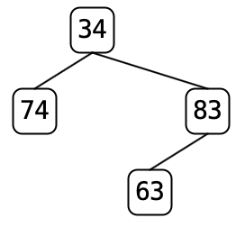
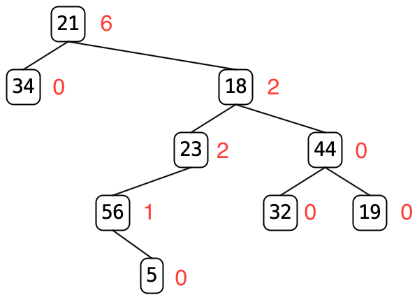

# Lab 6 -- Binary Trees

* [Lab 6 Home](index.html)
* [Warmup](warmup.html)
* [Part 1](part1.html)
* [Part 2](part2.html)
* Part 3
* [Submission](submission.html)

## Part 3 -- Implementing Your Binary Tree

Each of the methods listed below appears in the BinaryTree class as an
abstract method. Eclipse has given default implementations of them in
`ConsTree` and `EmptyTree`. Your task for each method is to provide correct
implementations in `ConsTree` and `EmptyTree` and test that they work using
the provided tree files.

**Note:** You do not need any loops in any of these methods.

Here is the complete list of methods for you to implement.

`public boolean isEmpty()`
: Returns `true` if the tree is empty. (You should know this based on the
  class itself.)

`public int height()`
: Returns the height of the tree. An empty tree has height -1, a single node has
 height 0.

`public int diameter()`
: Returns the diameter (or width) of the tree. This is the length of the
  longest path through the tree between two nodes without repeating any nodes
  along the path. There are three possible cases:
  1. The longest path is between two nodes in the left subtree.
  2. The longest path is between two nodes in the right subtree.
  3. The longest path is between one node in the left subtree and one node in the right subtree.
  In the first two cases, the root of the tree is not on the longest. (It
  couldn't be because otherwise the left/right child would appear in the
  path twice.) Thus the diameter of the whole tree must be the diameter of
  the subtree.

  In the third case, the longest path must include the root and therefore must
  be from the deepest leaf on the left to the deepest leaf on the right. We
  can compute that as the height of the left subtree plus the height of the
  right subtree plus 2. (We have to add 2 because the path from the left child
  → root → right child has length 2.)

`public int nodeCount()`
: Returns the number of nodes in the tree.

`public int leafCount()`
: Returns the number of leaves in the tree.

`public int levelCount(int level)`
: Returns the number of nodes at a given level in the tree. Level 0 is the
  level of the root node, level 1 are the (up to 2) children of the root, and so
  on.

`public BinaryTree<T> mirrorImage()`
: Returns a new tree which looks like the mirror image of the given tree
  (mirrored around the root node, so left becomes right and right becomes left.)
  As in the `clone()` method for `Collections`, the new tree should contain all new
  nodes, not sharing any with the original tree. However, the data objects in
  the tree should be the same objects as those in the original tree; those
  objects should not be cloned. (This is also known as a shallow copy.)

`public BinaryTree<T> pare()`
: Returns a new tree which is a copy of the current tree but omitting the
  children of any node which has fewer than two children. Starting at the root
  of the tree, if the current node has fewer than two children, return a new
  leaf node containing a shallow copy of the data. If the node has two children,
  return a new node containing a shallow copy of the data whose children are the
  result of calling pare on the left and right subtrees.

  For example, if we pare `tree7.txt` the tree changes from
   to .
  Nodes 74 and 63 have one child each and
  thus the whole subtree corresponding to those children will be removed
  leaving the result on the right

  Paring `tree9.txt` will remove every node except for the root because the
  root only has a single child.

  Paring any tree a second time should not change the tree since all nodes
  will have either zero or two children. (This is called a full binary tree.)

`public BinaryTree<T> cutLeaves()`
: Returns a new tree which is a copy of the current tree with all of the leaf
  nodes removed. As with `mirrorImage()` and `pare()`, the copy of the data should
  be shallow. Cutting the leaves of `tree7.txt` removes nodes 32, 29, and 18, leaving this.

  .

  Unlike `pare()`, `cutLeaves()` can be performed multiple times and each time
  will reduce the number of nodes in the tree until the tree is empty.

`public int weightBalanceFactor()`
: Returns the "weight-balance factor" of the tree. The weight-balance factor
  of a binary tree is a measure of how well-balanced it is; that is, how evenly
  its nodes are distributed between the left and right subtrees of each node.

  Define the weight-balance factor of a binary tree as follows: it is the
  maximum value of the absolute value of (number of nodes in left subtree minus
  number of nodes in right subtree) for all nodes in the tree. Whew! That takes
  some parsing!

  **Note:** This is a different measurement from the Height-Balance property of AVL trees.

  Here is an annotated example showing the WBF of all the nodes. (When you
  click the `Weight Balance Factor` button, you won't see these annotations.)
  
  - The leaves all have a WBF of 0.
  - Node 56's WBF is 1 because its right subtree contains 1 node and its left
    contains 0.
  - Node 23's WBF is 2 for the same reasons.
  - Node 44's WBF is 0 because its left and right subtrees contain the same
    number of nodes and have WBFs of 0.
  - Node 18's WBF is 2 even though its left subtree contains 3 nodes and its
    right subtree contains 3 nodes because its left subtree has a WBF of 2.
  - Node 21's WBF is 6 because its left subtree contains one node and its
    right subtree contains 7 nodes.

`public void preOrderElements(List<T> list)`
: Adds all of the elements of the tree to list using a preorder traversal of the tree.

`public void postOrderElements(List<T> list)`
: Adds all of the elements of the tree to list using a postorder traversal of the tree.

`public void inOrderElements(List<T> list)`
: Adds all of the elements of the tree to list using an inorder traversal of the tree.
{: .implement-box}

**Note:** The last three methods take a list as a parameter and append to it,
rather than creating a new list and returning it: this is to avoid creating
multiple lists. This also lets you implement these methods recursively.

### JUnit tests

Create a JUnit test file `BinaryTreeTest.java` and provide tests for each of
the methods above. For each one, use the `ConsTree` and `EmptyTree`
constructors to create a tree, call the method you're testing, and then check
that the output is correct.

[&laquo; Previous](part2.html)   [Next &raquo;](submission.html)