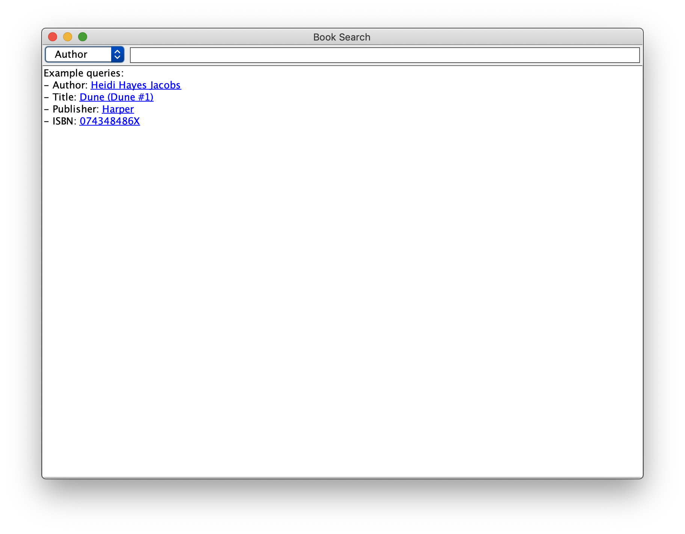

# Lab 7 -- Using AVL trees

* [Lab 7 Home](index.html)
* [Warmup](warmup.html)
* [Part 1](part1.html)
* Part 2
* [Submission](submission.html)


## Part 2 -- Book Search

In this part of the lab, you will use `MyTreeMap` to implement several methods
of looking up books that are present in the GoodReads data which was provided.

A GUI has been created for you in the `BookSearchFrame` class. You can run the
`main()` method in this class. You'll see something like the following image.



You can select different sorts of book searches, but because we're going to be
looking the items up in a `TreeMap`, the searches will have to exactly match
what's in the `GoodReadsData.txt` file. You can also click on the blue links to
perform the specified search…at least once you implement the required methods.

Your task is to implement the methods in `BookFinder.java`.

`BookFinder(String path)`
: The constructor is passed a path to the `GoodReadsData.txt` file. You need
  to open the file using something like
  ```java
  Scanner scanner = new Scanner(new File(path), "UTF-8");
  ```
  The parameter `"UTF-8"` informs the scanner that the file has been encoded
  using the UTF-8 Unicode encoding.

  Each line of the file contains five, comma-separated fields: ISBN, authors,
  title, publisher, and GoodRead's rating. For example,
  ```
  0446676500,Martin Luther King Jr./Clayborne Carson,The Autobiography of Martin Luther King  Jr.,Grand Central Publishing,4.35
  ```
  represents the data
  - ISBN: 0446676500
  - Authors: Martin Luther King Jr. and Clayborne Carson
  - Title: The Autobiography of Martin Luther King  Jr.
  - Publisher: Grand Central Publishing
  - Rating: 4.35

  Note that in the author field, authors are separated by a `/` character.

  Read in each line using your scanner, split it into the five fields. Split
  the author field into 1 or more authors and create an instance of the
  `BookData` class to represent the book. (You should not modify the
  `BookData` class itself.)

  Add the `BookData` to the `isbnToData`, `titleToData`, `authorToData`, and
  `publisherToData` maps. Note that the last three of those maps have
  `ArrayList<BookData>` as values rather than just a single `BookData`.

`List<BookData> searchByAuthor(String author)`
`List<BookData> searchByTitle(String title)`
`List<BookData> searchByPublisher(String publisher)`
`BookData searchByIsbn(String isbn)`
: Implement each of these methods by looking the information up in the appropriate map.
{: .implement-box}

Once you've implemented these methods, you should able able to run your GUI
and perform some searches. I found it interesting to search for an author and
see who they have published with. For example, try out an author search for
Terry Pratchett.

[&laquo; Previous](part1.html)   [Next &raquo;](submission.html)