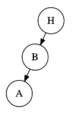
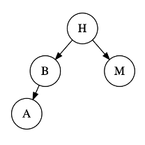
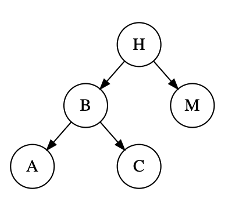
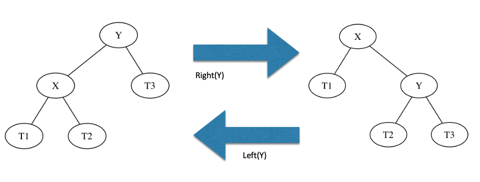
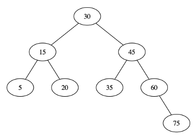

# Lab 7 Warmup

* [Lab 7 Home](index.html)
* Warmup
* [Part 1](part1.html)
* [Part 2](part2.html)
* [Part 3](part3.html)
* [Submission](submission.html)


## AVL Tree Rotations

As we have explored in class, binary trees have some performance characteristics that give us O(log(n)) insertion, search, and retrieval, but only if the tree is balanced.  If the tree is unbalanced, the binary tree essentially becomes a linked list, and we are back to O(n) performance.

A simplistic way of balancing a tree is to sort the data, and then pick the midpoint of each place on the data as the node to insert.  This has huge consequences, though, as sorting is not a trivial cost.  In addition, this has to be done each time a tree is modified.

What we would like to do, instead, is to be able to modify our tree a constant number of steps each time it is modified, and have the tree remain balanced at the end of the operation.  Adelson-Velskii & Landis (AVL) trees do exactly this.  Each insertion in an AVL tree, the tree analyzes its structure, then reorganizes itself to maintain balance using a constant number of operations. This allows our overall runtime from each operation to be O(log(n)).

## Height Balance Property

AVL trees work by maintaining the **Height Balance Property**.  For every internal node *v* of tree *T*, the heights of the children of *v* may differ at most by 1.  We will consider the height of an empty subtree as being -1.

For each of the following trees, calculate the height of each of the nodes.  Mark if the tree is balanced or unbalanced according to the **Height Balance Property** as defined above. Document your answers in `README.txt`.

Tree 1:



Tree 2:



Tree 3:



Tree 4:


Once you have identified the *unbalanced node* with the Height Balance Property above, identify which of its children has the greatest height, and which of that child's children have the greatest hight.  This will yield one of four possible cases, based on directions of maximum height of subtrees from the unbalanced node: Left-Left, Left-Right, Right-Right, and Right-Left.

To take care of the imbalance in each of these cases, we perform "rotation" operations, which detach and reattach subtrees at carefully chosen points. There are two types of rotations: **Left** and **Right** rotations. In the following image, we are doing a **Right** and a **Left** rotation on the Y node. A **Right** rotation makes `X` the new root of the subtree, and the old root `Y` becomes the right child. The subtrees `T1`, `T2`, and `T3` are then reassigned as in the picture below. A **Left** rotation is just a **Right** rotation, but in reverse.



To handle each of the four cases (Left-Left, Left-Right, Right-Right, and Right-Left), we require a sequence of rotations described below:

### Left-Left

A single rotation will fix this inbalance.  We will do a **Right** rotation on the unbalanced node’s **Left** child

### Left-Right

No single rotation will fix this inbalance, so we will need to perform two rotations.  We will first perform a **Left** rotation on unbalanced node’s left node’s right child and then a **Right** rotation on unbalanced node’s left child.

### Right-Right

This is a mirror-image of the Left-Left case above.  We will do a **Left** rotation on the unbalanced node's **Right** child.

### Right-Left

Similarly, this is a mirror of the Left-Right case above, so we will do a **Right** rotation on the unbalance node's **Left** child.

## Algorithmic Solution

Another way of looking at AVL trees is to instead of performing rotations, we will instead determine the heights of subtrees and move the pointers around to balance the tree.  This algorithm is what is usually performed in practice, and the results are identical to performing the rotations.  Conceptually, it's easier to understand the rotations first, and then explore the algorithm.

The process is:

1. Walking up the tree from the insertion point to the root, label first node that fails height balance property as Z.
1. Z's tallest subtree is labeled Y
1. Y's tallest subtree is labeled X
1. Set A, B, and C to be the in-order listing of X, Y, and Z. That is, you should have A<B<C.
4. T0, T1, T2, T3 are the subtrees of X, Y, and Z (other than X, Y, and Z themselves), labeled from left to right.

Here's an example of what that could look like:

  ```
         C
        / \
       B   T3
     /   \
    A     T2
   / \   
  T0 T1  
  ```
Once you've identified A, B, C, T0, T1, T2, and T3, rebuild the subtree to look like this:

  ```
       b
     /   \
    a     c
   / \    / \
  t0 t1  t2 t3
  ```
  
Now let's try it yourself! Insert the value 80 into a the following balanced AVL tree. Record your answer in `README.txt` (e.g. in the text-based format used in the trees above).



You'll be implementing this algorithm in Part 1 of this week's lab.


## CSV parsing

In the second part of this week's lab, you'll be implementing a book database program. You'll be loading in data from the internet to build your database. Your data will be stored in a Comma Separated Values (CSV) file, a common way of storing tables of information.  This file is exactly what it sounds like, a set of data points that is separated by commas, one line per record. These come up all the time in e.g. spreadsheet programs like Microsoft Excel.

As an example, a file that contains CS classes, their names, and instructors, could be:

150,Introduction to Programming,Alice  
151,Data Structures,Bob  
210,Computer Organization,Clair  
241,Systems Programming,David

To parse this data, we are going to use two Scanner objects.  The first scanner will read from the input file and export a **line** of data.  The second scanner object will read from the output of the first scanner (a line of data) and split it into data points.


	Scanner input = new Scanner(new File(path), "UTF-8");
	
	while ( input.hasNextLine() ) {   / keep looping for each line, use 'break' to exit

		String line = input.nextLine();     // Read the next line of input from the file

		Scanner s2 = new Scanner(line).useDelimiter(",");     // s2 will let me break 'line' apart

		if  ( s2.hasNext() ) {           // check to see if there is more data on this line
				// Yay! do something with this
				nextEntry = s2.next();       // read in that data
		}
	} 

[&laquo; Previous](index.html)   [Next &raquo;](part1.html)