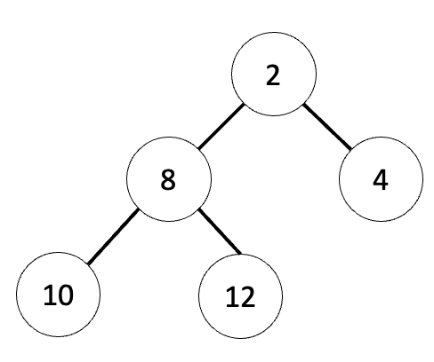
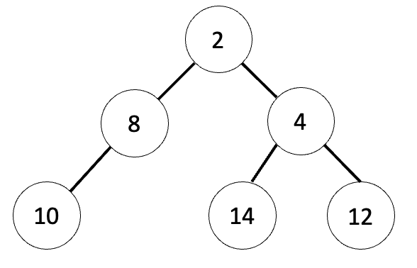

# Lab  Warmup

* [Lab 8 Home](index.html)
* Warmup
* [Part 1](part1.html)
* [Part 2](part2.html)
* [Submission](submission.html)

## Part 1: MyPriorityQueue

In this section of the lab, you will be implementing your own version of a binary heap based Priority Queue. To begin, you should probably look over the Java documentation for a [PriorityQueue&lt;T&gt;](https://docs.oracle.com/javase/7/docs/api/java/util/PriorityQueue.html) and for [java.util.AbstractQueue&lt;T&gt;](https://docs.oracle.com/javase/7/docs/api/java/util/AbstractQueue.html) which it extends.

Recall from class the following facts about heaps:
  - A heap uses an array or ArrayList to represent a binary tree.
  - All nodes in the binary tree are filled except for the last row.
  - All nodes to the left on the last row are filled.
  
 So this binary tree would be a heap:
  
  
  
 But this binary tree would not:
  
 
  
In this lab, you will be using an ArrayList to hold your binary tree representation.  With a partner, come up with answers to the following questions.  Assume that your ArrayList is a class variable named "heap"

1. At what index will you store the root of the tree?
2. At what index is the parent of the node at index i?
3. At what index is the left child of the node at index i?
4. At what index is the right child of the node at index i?

To insert into a heap, you will add your new value at the end of the ArrayList, and then "percolate" it up into the next position.  With a partner, write pseudocode for a helper method `private void percolateUp(int hole)` that percolates the item at position hole up through the heap by checking if it’s smaller than its parent, and swapping and recursing if it is.
  
## Part 2: Comparators
  
In order to make these heaps work, you will need to create Comparators of various sorts. Begin by looking over the documentation for [java.util.Comparator&lt;T&gt;](https://docs.oracle.com/javase/7/docs/api/java/util/Comparator.html). Pay special attention to the compare() method you are required to implement.
  
Note that Java has two ways of comparing objects, Comparables and Comparators.  Objects in Java that implement the Comparable interface must include a `int compareTo(T o)` method, which returns an int indicating if the current instance is smaller, larger, or equal to *o*. Objects that implement Comparable are assumed to have a single, "natural ordering": for example, Integers sorted by magnitude, or Strings sorted by the ASCII value of their first letter.  In this case, the compareTo method is a part of the class definition of the objects being compared.
  
On the other hand, Comparators exist as their own class, outside of the class of object they are comparing.  Comparators are frequently used to compare objects that do not have a natural ordering: we can implement different comparator classes to sort objects on different characteristics.  For example, you could imagine creating a comparator that sorted Strings by length, and a different comparator that sorted Strings by alphabetical value.
  
With a partner, write Java code for a comparator class StringComparator that compares two Strings, but does not care about the case of the strings themselves. Hint, you might want to just let the String's compareToIgnoreCase(); method do all the heavy lifting. It will also be helpful to look at `AvailableComparator.java`, the comparator class we provide you with.

[&laquo; Previous](index.html)   [Next &raquo;](part1.html)