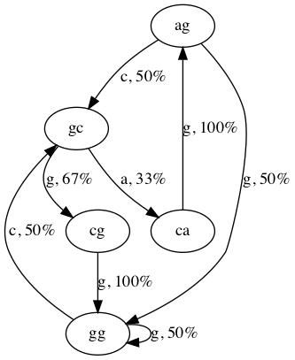

# Lab 9 -- Million Monkeys with Typewriters

* [Lab 9 Home](index.html)
* [Part 1](part1.html)
* Part 2
* [Part 3](part3.html)
* [Submission](submission.html)


## Part 2 -- Text Generation
### Markov Models

You will be using a Markov model for the somewhat silly purpose of generating
stylized pseudo-random text; however, Markov models have plenty of "real"
applications in speech recognition, handwriting recognition, information
retrieval, and data compression.

Our Markov model is going to generate one character of our output at a time.
In order to determine what this next character is, we will need to look at the
sample text to determine what character is most likely to occur at this point
in the text. In order to determine what character is most likely to occur, we
look at the last few characters we generated, and try to find those character
in our sample text. Hopefully we'll find it a bunch of times, and from these
occurrences we try to figure out what character should occur next.

For example, suppose we have already generated the text `I do not like them`,
and we want to determine the next character. Then, we may look in the sample
text for all occurrences of the substring `ke them, `, and we may find that
the substring occurs 10 times: 7 times it is followed by `Sam-I-am`, 2 times
it is followed by [`on a boat`](http://www.youtube.com/watch?v=k8F3UE9qFsg),
and once it is followed by `on a house`. Then, with 7/10 probability, the next
character is an `S`, and with 3/10 probability it is an `o`.

Now if you think about it, the further back we look in the text, the more our
generated text will resemble the original. However, looking farther back
requires a lot more work and space, and produces less interesting text. So
there are trade-offs to consider. The Markov model formalizes this notion as
follows.

An order 0 Markov model looks in the sample text for the previous 0 characters
of our generated text. That is, given an input text, you compute the Markov
model of order 0 by counting up the number of occurrences of each letter in
the input and use these as the frequencies. For example, if the input text is
`agggcagcgggcg`, then the order 0 Markov model predicts that each character is
a with probability 2/13, c with probability 3/13, and g with probability 8/13.
This has the effect of predicting that each character in the alphabet occurs
with fixed probability, independent of previous characters.

Characters in English text are not independent, however. An order _k_ Markov
model looks back at the previous _k_ characters in the generated text, and
bases its prediction on that substring of length _k_. That is, given an input
text, you compute a Markov model of order _k_ by counting up the number of
occurrences of each letter that follows each sequence of _k_ letters. For
example, if the text has 100 occurrences of `th`, with 50 occurrences of
`the`, 25 occurrences of `thi`, 20 occurrences of `tha`, and 5 occurrences of
`tho`, the order 2 Markov model predicts that the next character following
`th` is `e` with probability 1/2, `i` with probability 1/4, `a` with
probability 1/5, and `o` with probability 1/20.

### Representation of a Markov model

Mathematically, an order _k_ Markov model is a set of states and transitions
between states. Each state represents the most recent _k_ characters that have
been generated. Each transition is associated with a character to generate and
the probability of generating that character.

Let's look at an example. If _k_ is 2 and the input string is `agggcagcgggcg`,
then the Markov model will be constructed by looking at each substring of
length 2 and looking at the letter that follows it.
```
ag ↦ g
gg ↦ g
gg ↦ c
gc ↦ a
ca ↦ g
ag ↦ c
gc ↦ g
cg ↦ g
gg ↦ c
gc ↦ g
```

This is the basis for our transitions. Notice that since the final two
characters in the input string aren't followed by a character, they're not
included in the list. If you look carefully at the list, you'll notice that
there are only five distinct 2-letter substrings, `ag`, `gg`, `gc`, `ca`, and
`cg`. These are our states.

We can summarize our list by counting how many times each _k_-letter substring
is followed by a given character.
```
ag ↦ 1 c, 1 g
ca ↦ 1 g
cg ↦ 1 g
gc ↦ 1 a, 2 g
gg ↦ 2 c, 2 g
```
That is, `ag` is followed by `c` one time and by `g` one time; `gc` is
followed by `a` one time and by `g` two times in our input string.

We can turn these counts into probabilities. `ag` is followed by `c` 50% of
the time and by `g` 50% of the time. `gc` is followed by `a` 33% of the time
and by `g` 67% of the time. These are our transitions. They're called
transitions because using them, we can transition from one state to another.
For example, if we start with the text `ag`, then we say that our model is in
state `ag`. We'll generate a `c` with 50% probability which will bring the
model to state `gc` (because our output string is now `agc` and `gc` are the
last _k_ = 2 characters). We can represent the Markov model graphically like
this.



The ovals are the states (which are the final _k_ characters in our generated
string) and the arrows are the transitions which are labeled with the
character to generate in a given state along with its probability.

We started in state `ag` and generated a `c` which took us to state `gc`. Now,
with 67% probability, we'll generate a `g` bringing our output string to
`agcg` and taking us to state `cg`. This process continues until we've
generated as much output as we desire.

### Implementing a Markov model

To represent an order _k_ Markov model in code, we are going to keep a hash
map from length-_k_ strings to `State` objects. Each `State` object will maintain a
hash map from characters to integers to represent the transitions. Continuing
our example, the `State` for gc will have a map:
```
a ↦ 1
g ↦ 2
```

For efficiency, each `State` maintains a count that is the sum of all of the
values in its transitions map. E.g., for `gc`, count is 3. This implicitly
encodes the probability of generating each character. To compute the
probability of generating a `g` in a given `State`, we'd look up `g` in the
transitions map and divide the value by the count. For the `State` `gc`, that
gives 2/3. (We'll see a simple way to select one of the characters to generate
below that uses the counts rather than the frequency.)

To build the model, we need to train it on an input string. `MarkovModel` has
a method `train(input)` that you will implement. The `train(input)` method
will look at each length-(_k_ + 1) substring of its input and call the
`add(prefix, suffix)` where `prefix` is the first _k_ characters of the
substring and `suffix` is the final character. The `add()` method will use the
`prefix` to look up (or create) the corresponding `State` in its states map
and then call `state.add(suffix)`. The `State`'s `add(suffix)` method will
lookup the `suffix` in its transitions map and increment the count.

Start by implementing the `MarkovModel`'s `train()` and `add()` methods as
well as the `State`'s `add()` method. Ignore `generate()` and `randomSuffix()`
for now; we'll return to them when we get to generating text shortly.

`public void train(String input)`
: Iterate over the input string starting with index this.order and use
  `input.charAt(index)` to get the suffix and `input.substring(index - this.order,
  index)` to get the `prefix`. Call `add(prefix, suffix)`.

`public void add(String prefix, char suffix)`
: Look up or create a `State` corresponding to `prefix` in `this.states`. Call
  `add(suffix)` on it.

`void add(char suffix)`
: This is in the `State` class. This method should increment the integer in
  the transitions map corresponding to `suffix`. Don't forget to increment the
  `State`'s `count` variable as well.
{: .implement-box}

Once you've done this, you should be able to run `MarkovModel`. It requires two
command line parameters. The first parameter is the order of the model. The
second parameter is the path to a file to use to train. Try it with command
line arguments: `2 samples/example.txt`

### Generator

Now that we can build a Markov model, it's time to use it to generate some
text! You'll need to implement `MarkovModel`'s `generate()` method and `State`'s
`randomSuffix()` method as well as create a new class which will build a model
and then generate some text.

To generate text, we need a pseudorandom number generator. Fortunately, Java
provides one for us called
[`SecureRandom`](https://docs.oracle.com/en/java/javase/11/docs/api/java.base/java/security/SecureRandom.html).
(There are others; they should never be used.) Both of the methods take a
parameter `rand` of type
[`Random`](https://docs.oracle.com/en/java/javase/11/docs/api/java.base/java/util/Random.html)
which is a super class of `SecureRandom`.

`public String generate(String prefix, int length, Random rand)`
: This method generates a string of length `length` that starts with `prefix`.
  The `prefix` must be a string whose length is the same as the order of the
  model.

  Start by getting the initial state by looking `prefix` up in the states map. If
  the initial state is `null`, throw an `IllegalArgumentException`.

  Create a `StringBuilder` that's initialized to the `prefix`:
  ```java
  StringBuilder sb = new StringBuilder(prefix);
  ```
  In a loop, use the `StringBuilder`'s `substring()` method to get a string of
  length _k_ where _k_ is the order of the model from the end of the `StringBuilder`.
  Look up the `State` corresponding to the substring. If it's not in the map, then
  using the initial `State` instead. Call `state.randomSuffix(rand)` which returns a
  character. Append it to the string builder.

  Once the string is long enough, use `sb.toString()` to construct a string and
  return it.

`char randomSuffix(Random rand)`
: This method should iterate over the entries in this.transitions.entryList()
  and return one of the characters at random. The tricky part is that each
  character should be returned with the appropriate probability.

  Fortunately, there's a simple method we can use to do this. Imagine the
  state has the following mapping
  ```
  ' ' ↦ 9
  'a' ↦ 3
  'e' ↦ 1
  'r' ↦ 7
  ```

  That is, during training, the space was the next character 9 times, a was
  the next character 3 times, e was the next character 1 time, and r was the
  next character 7 times. Since the sum of those (the state's count variable) is
  20, we can generate a random integer `x` in the range [0, 20). Now, we can check
  in order:
  - if `x < 9`, then return a space
  - if `x < 12`, then return `a`
  - if `x < 13`, then return `e`
  - if `x < 20`, then return `r`

  Since `x` is definitely less than 20, it will return one of those. We can easily
  turn this into a loop by noticing that after each check, we can decrement `x` by
  the value we were comparing against. This gives the algorithm.
  - if `x < 9`, then return a space, otherwise set `x` to `x - 9`
  - if `x < 3`, then return `a`, otherwise set `x` to `x - 3`
  - if `x < 1`, then return `e`, otherwise set `x` to `x - 1`
  - if `x < 7`, then return `r`, otherwise set `x` to `x - 7`

  To generate `x`, use
  ```java
  int x = rand.nextInt(this.count);
  ```

  There should only be a single call to `rand.nextInt()` per call to `randomSuffix()`.
{: .implement-box}

Finally, create a class `TextGenerator` that takes as command line parameters an
integer order, an integer length, and a filename file, and prints out length
characters according to the Markov model of the given order trained on the
contents of file.

### Testing

You should test out your text generation with very simple inputs first, such
as with a file containing `flippyfloppies` and small order and length.

Once you get that working, you should try it on some of the files provided in
samples. You will find that the generated text starts to sound more and more
like the original text as you increase the order of the model, as illustrated
in the examples in the [next part](part3.html). As you can see, there are
limitless opportunities for amusement here. Try your model on some of your own
text, or find something interesting on the Internet.

[&laquo; Previous](part1.html)   [Next &raquo;](part3.html)